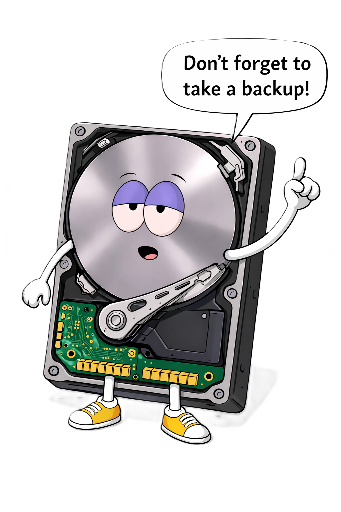

<div align="center"><h1> ｅｄｃｔｏｏｌｋｉｔ</h1>
 <alt="EDCtoolkit logo" width="160">>PoSh toolkit for endpoint triage and troubleshooting.
<br> More troubleshooting assistance coming</div></h4>
<p align="center"></p>
<br><br></c>


## What It Includes

- `Scripts/EDCtoolkit/edctoolkit.ps1`: interactive CLI toolkit
- `Scripts/EDCtoolkit/EDCtoolkit.GUI.ps1`: WinForms GUI wrapper
- `EDCtoolkit.cmd`: launcher convenience script

## Quick Start

### GUI

```powershell
powershell.exe -ExecutionPolicy Bypass -File .\Scripts\EDCtoolkit\EDCtoolkit.GUI.ps1
```

### CLI

```powershell
powershell.exe -ExecutionPolicy Bypass -File .\Scripts\EDCtoolkit\edctoolkit.ps1
```

## Reports

Reports are saved under:

`Scripts/EDCtoolkit/EDC_Reports`

The GUI can also export a combined report to a file you choose.

## Notes

- Run as Administrator for the most complete results and fix actions.
- The GUI is non-interactive for scan checks (no hidden terminal prompts).


